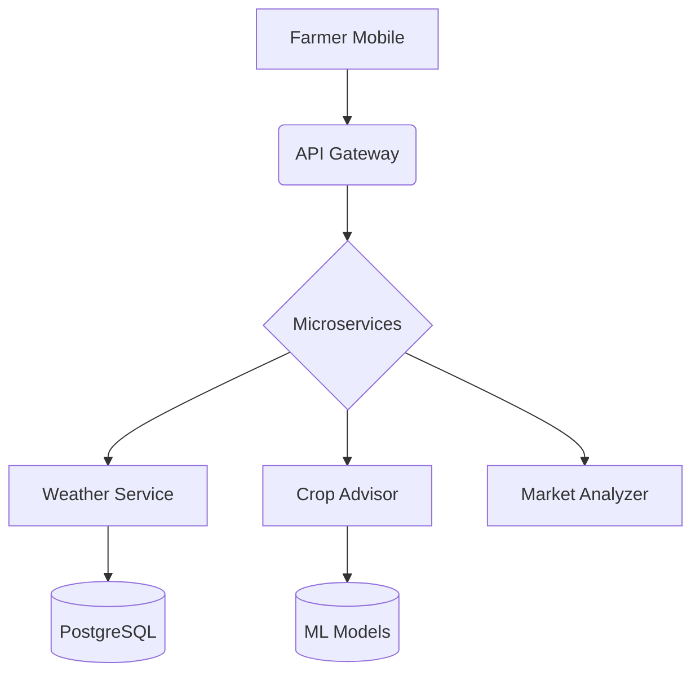

# 🚀 ThePlutoDestroyer: Next-Gen Agricultural Intelligence Platform
**Winning Solution @ TechVerse CT University Hackathon 2025**  


## 🌱 Mission Statement
Revolutionizing agricultural decision-making through:
- **Real-time weather pattern analysis** (weather-backend)
- **AI-powered crop recommendations** (kisan vikas modules)
- **Farmer-centric interface** (React frontend)

## 💡 Core Features
<div align="center">

| Module | Key Capabilities | Tech Stack |
|--------|------------------|------------|
| **Weather Analytics** | Predictive modeling, Historical data analysis | Python, TensorFlow, PostgreSQL |
| **Kisan Vikas** | Crop suggestions, Market trends | React, Chart.js, REST API |
| **Farmer Portal** | Multilingual support, SMS alerts | Material-UI, Twilio integration |

</div>

## 🛠️ Project Architecture
```bash
ThePlutoDestroyer/
├── HACKATHON/
│   ├── backend/                  # Microservice architecture
│   │   └── training.py    # ML models for yield prediction
│   ├── frontend/
│   │   ├── public/               # Localization assets
│   │   └── src/                  # React components
│   └── weather-backend/          # Meteorological data pipeline
```

## ⚡ Quick Start
### Prerequisites
- Node.js 18.x | Python 3.10+


```bash
# Clone with submodules
git clone --recurse-submodules https://github.com/TechVesrse-CT-University/ThePlutoDestroyer.git

# Frontend setup
cd HACKATHON/frontend/kisan\ vikas
npm install
cp .env.example .env
npm run build

# Backend services
cd ../../weather-backend
python -m venv venv
source venv/bin/activate
pip install -r requirements.txt
python run main.py
```

## 🌐 Deployment Topology


## 🤝 Contributing
We welcome technical contributions through:
1. **Issue Tracking**: Report bugs via GitHub Issues
2. **Feature Development**: 
   - Fork → Feature Branch → Pull Request
   - Follow Angular Commit Message Convention
3. **Documentation**: Improve docs via Wiki edits

## 📌 Roadmap
- Q2 2025: Regional language support (Hindi/Tamil)
- Q3 2025: IoT integration for soil sensors
- Q4 2025: Government API integration (e-NAM)

## 🙌 Acknowledgments
- **Hackathon Mentors**: TechVerse CT University Panel
- **Core Team**: [HARSHITA005-GARG](https://github.com/HARSHITA005-GARG) et al.
- **Data Partners**: IMD, NASSCOM AgriTech
