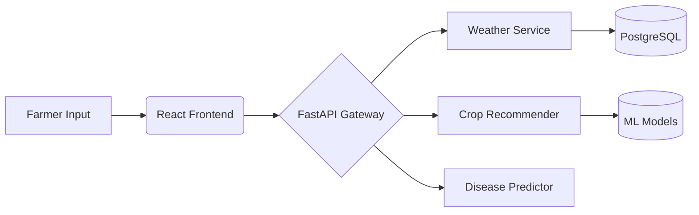

# 🌦️ AgriWeather Intelligence Platform
**2025 TechVerse CT University Hackathon Winning Solution**  


## 🌟 Key Features
- Real-time weather data processing pipeline
- Crop recommendation system with ML integration
- Disease prediction using deep learning models
- Farmer-friendly React dashboard

## 🏗️ Project Structure
```bash
ThePlutoDestroyer/
└── HACKATHON/
    ├── backend/
    │   ├── Diseases.png                      # Disease classification samples
    │   ├── Train_plant_disease-checkpoint.ipynb  # Model training notebook
    │   ├── trained_plant_disease_model.keras # Pretrained CNN model
    │   └── training_hist.json                # Training metrics
    ├── frontend/kisan vikas/                 # Farmer dashboard
    │   ├── public/                           # Static assets
    │   └── src/                              # React components
    └── weather-backend/                      # Core weather service
        ├── app.py                            # FastAPI endpoints
        ├── crop_data.csv                     # Agricultural dataset
        └── requirements.txt                  # Python dependencies
```

## 🚀 Quick Start
### Backend Setup
```bash
cd HACKATHON/weather-backend
python -m venv venv
source venv/bin/activate  # Windows: venv\Scripts\activate
pip install -r requirements.txt
python run app.py
```

### Frontend Setup
```bash
cd HACKATHON/frontend/kisan vikas
npm install
npm run dev
```

## 🔍 Core Components
### Weather Service (FastAPI)
Endpoints:
```python
@app.get("/weather/predict")
async def predict_weather(lat: float, lon: float):
    # Integration with IMD APIs
    return {"prediction": "sunny"}

@app.post("/crop/recommend")
async def recommend_crop(soil_data: SoilSchema):
    # ML model integration
    return {"crop": "wheat"}
```

### Disease Prediction Model
Load pretrained Keras model:
```python
from tensorflow.keras.models import load_model
model = load_model('trained_plant_disease_model.keras')
```

## 📊 Data Flow


## 🧪 Testing
Run Jupyter notebook for model evaluation:
```bash
jupyter notebook HACKATHON/backend/Train_plant_disease-checkpoint.ipynb
```

## 🤝 Contribution
1. Fork the repository
2. Create feature branch:
   ```bash
   git checkout -b feat/new-weather-endpoint
   ```
3. Commit changes following [Conventional Commits](https://www.conventionalcommits.org)
4. Open Pull Request

## 🙌 Core Team
- **Backend Lead**: [HARSHITA005-GARG](https://github.com/HARSHITA005-GARG)


> **Note**: Production deployment guidelines available in [DEPLOYMENT.md](DEPLOYMENT.md)
